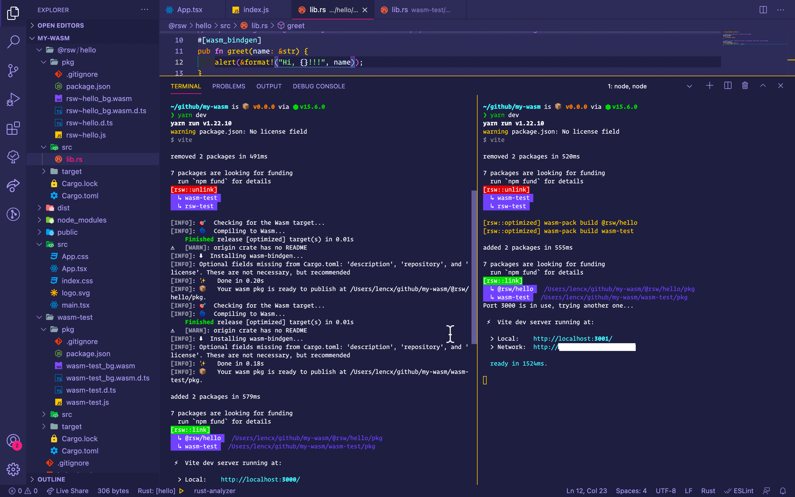

# Vite Rsw插件启动优化

插件地址: https://github.com/lencx/vite-plugin-rsw

## 启动缓慢

> 项目首次启动，会经历以下步骤

1. 执行`wasm-build`，会在当前目录下生成`pkg`目录，`pkg`目录中的文件是一个标准的npm包。
2. 如果插件有配置`unLinks`，则会执行`npm unlink`，卸载npm包。
3. 把在`1步骤`中生成的npm包，通过`npm link`，安装npm包。

**总结：2，3步骤耗时短，几乎可以忽略不计，但是1步骤执行构建，会花费大量时间，而且如果有多个`rust crates`，则耗时会翻倍。虽然`vite`本身速度很快，但是在使用插件后启动速度会被拉垮。**

## 优化思路

当启动服务的时候，会执行`npm run dev`命令，每次执行该命令，都会执行`wasm-build`，生成`xx/pkg`目录，`pkg`中包含有`package.json`，如果目录中包含`package.json`，是不是就意味着该`rust crate`已经被构建过了，否则就是未构建。带着这个思路，开始项目优化。

```js
// 核心代码：如果`package.json`存在则跳过执行
// https://github.com/lencx/vite-plugin-rsw/blob/main/src/compiler.ts#L81-L88
const pkgPath = path.resolve(root, getCrateName(_crate), 'pkg');
// vite startup optimization
try {
  fs.statSync(`${pkgPath}/package.json`).isFile();
  console.log(chalk.yellow(`[rsw::optimized] wasm-pack build ${getCrateName(_crate)}`));
} catch (e) {
  compileOne({ config: opts, crate: _crate, sync: true });
}
```

**总结：经过优化之后的代码，只有在未构建的情况下会执行构建，如果都构建过，之后的启动会跳过构建，使其接近`vite`项目原本启动速度。**


