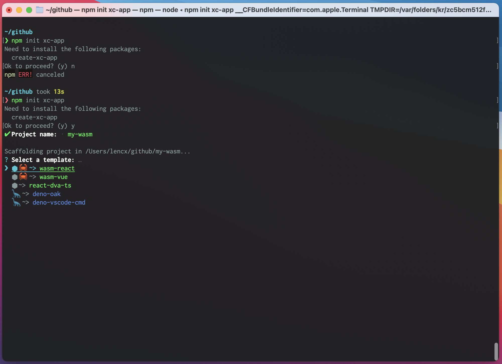
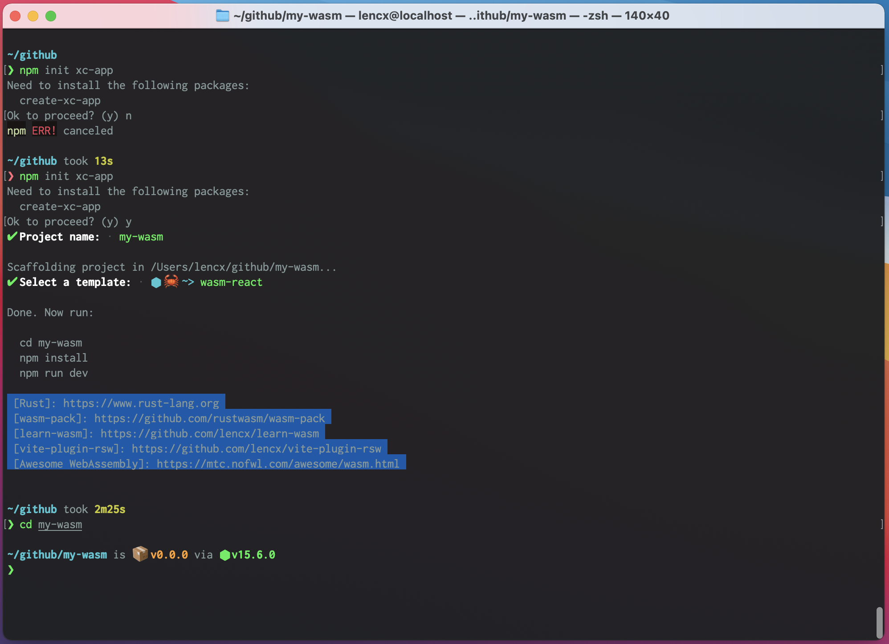
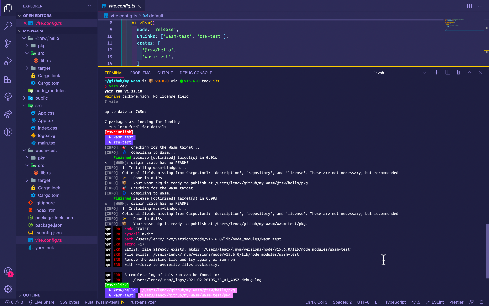
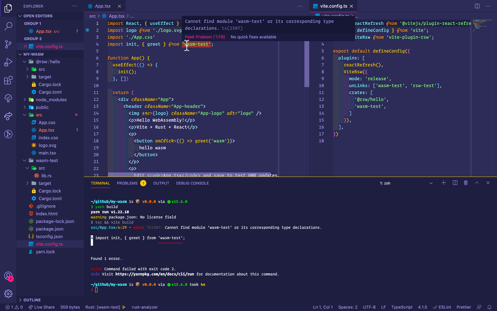
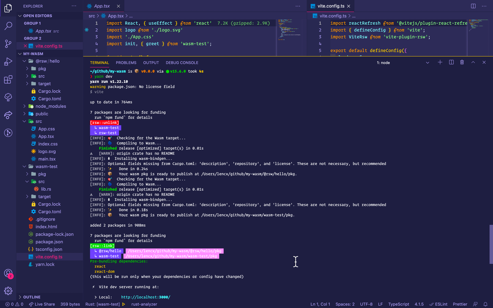

# Vite与Rust邂逅 💖 WebAssembly

## 名词解释

* `Vite`: 下一代前端工具
* `Rust`: 一门赋予每个人构建可靠且高效软件能力的语言
* `WebAssembly`: WebAssembly（缩写为Wasm）是基于堆栈的虚拟机的二进制指令格式。 Wasm被设计为编程语言的可移植编译目标，从而可以在Web上为客户端和服务器应用程序进行部署。
* `vite-plugin-rsw`: Vite的一个插件，集成了`wasm-pack`的CLI，生成`wasm`的npm包，实现了文件变更，自动构建及热更新。

## 背景

从发布`vite-plugin-rsw`插件到现在也过去了一段时间，期间有些朋友询问过前端项目该如何使用`wasm`的代码或调用`wasm`中的方法。当一个问题被多次回答，就想做一个可以快速开始的Wasm模板。

目前模板支持`React`和`Vue3`项目

```bash
# 根据命令行提示创建项目
# 使用npm
npm init xc-app

# 使用yarn
yarn create xc-app

# ------------------------

# 直接创建一个特定的模板项目
npm init xc-app my-wasm-app --template wasm-react
```




## 常见问题

* 插件内部是通过`npm link`的形式实现的wasm包安装，在一些极端场景下会出现，找不到依赖的安装包，导入的包不存在等错误，可以根据提示路径删除其link的文件，重新启动`npm run dev`就可以解决。



* 插件是处于Vite开发模式下运行构建，所以至少执行过一次`npm run dev`，生成`wasm`包之后，再执行`npm run build`，否则也会报错，到不到`.wasm`文件之类的。



* 插件API可以配置需要卸载的包文件(仅限于之前通过插件配置`crates`中rust项目)

```js
// vite.config.ts
import { defineConfig } from "vite";
import ViteRsw from "vite-plugin-rsw";

export default defineConfig({
  plugins: [
    ViteRsw({
      // 支持开发(dev)和生产模式(release)
      // 生产模式会对wasm文件的体积进行优化
      mode: "release",
      // 如果包在`unLinks`和`crates`都配置过
      // 会执行，先卸载(npm unlink)，再安装(npm link)
      // 例如下面会执行
      // `npm unlink wasm-test rsw-test`
      unLinks: ['wasm-test', 'rsw-test'],
      // 项目根路径下的rust项目
      // `@`开头的为npm组织
      // 例如下面会执行:
      // `npm link @rsw/hey rsw-test`
      // 因为执行顺序原因，虽然上面的unLinks会把`rsw-test`卸载
      // 但是这里会重新进行安装
      crates: ["@rsw/hey", "rsw-test"],
    }),
  ],
});
```



## 相关链接

* «Vite»: https://vitejs.dev
* «Rust»: https://www.rust-lang.org
* «WebAssembly»: https://webassembly.org
* «vite-plugin-rsw»: https://github.com/lencx/vite-plugin-rsw
* «create-xc-app»: https://github.com/lencx/create-xc-app
* «learn-wasm»: https://github.com/lencx/learn-wasm
* «Awesome WebAssembly»: https://mtc.nofwl.com/awesome/wasm.html
