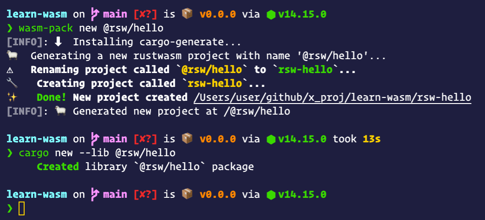

# WebAssembly入门

## Wasm是什么?

> [MDN官方文档](https://developer.mozilla.org/en-US/docs/WebAssembly)是这样给出定义

WebAssembly(为了书写方便，简称Wasm)是一种新的编码方式，可以在现代的网络浏览器中运行 － 它是一种低级的类汇编语言，具有紧凑的二进制格式，可以接近原生的性能运行，并为诸如C / C ++等语言提供一个编译目标，以便它们可以在Web上运行。它也被设计为可以与JavaScript共存，允许两者一起工作。

对于网络平台而言，WebAssembly具有巨大的意义——它提供了一条途径，以使得以各种语言编写的代码都可以以接近原生的速度在Web中运行。在这种情况下，以前无法以此方式运行的客户端软件都将可以运行在Web中。

WebAssembly被设计为可以和JavaScript一起协同工作——通过使用WebAssembly的JavaScript API，你可以把WebAssembly模块加载到一个JavaScript应用中并且在两者之间共享功能。这允许你在同一个应用中利用WebAssembly的性能和威力以及JavaScript的表达力和灵活性，即使你可能并不知道如何编写WebAssembly代码。

---

在学习于航老师的《WebAssembly入门课》开篇词中，老师是这样总结的`“WebAssembly 是基于栈式虚拟机的虚拟二进制指令集（V-ISA），它被设计为高级编程语言的可移植编译目标”。`

带着好奇心，开启我们的Wasm学习之路，创建属于自己的第一个Wasm应用

## 环境安装

### [Rust](https://www.rust-lang.org/zh-CN/learn/get-started)

> 一门赋予每个人 \
> 构建可靠且高效软件能力的语言。

* 安装

```bash
# macOS
curl --proto '=https' --tlsv1.2 -sSf https://sh.rustup.rs | sh

# 其他安装方式
# https://forge.rust-lang.org/infra/other-installation-methods.html
```

* 命令

```bash
# 版本更新
rustup update

# 查看版本
cargo --version

# 构建项目
cargo build

# 运行项目
cargo run

# 测试项目
cargo test

# 为项目构建文档
cargo doc

# 将库发布到 crates.io
cargo publish
```

```bash
# nightly rust
rustup toolchain install nightly

rustup toolchain list

rustup override set nightly
```

## [Node.js](https://nodejs.org/en/download)

> Node.js是基于Chrome的V8 JavaScript引擎构建的JavaScript运行时

## [wasm-pack](https://github.com/rustwasm/wasm-pack)

> 用于构建和使用您希望与JavaScript，浏览器或Node.js互操作的Rust生成的WebAssembly。

* 安装

```bash
# macOS
curl https://rustwasm.github.io/wasm-pack/installer/init.sh -sSf | sh

# 其他安装方式
# https://rustwasm.github.io/wasm-pack/installer
```

* 命令

```bash
# 创建
# https://rustwasm.github.io/docs/wasm-pack/commands/new.html
wasm-pack new <name> --template <template> --mode <normal|noinstall|force>

# 构建
# https://rustwasm.github.io/docs/wasm-pack/commands/build.html
wasm-pack build
  [--out-dir <out>]
  [--out-name <name>]
  [--<dev|profiling|release>]
  [--target <bundler|nodejs|web|no-modules>]
  [--scope <scope>]
  [mode <normal|no-install>]

# 测试
# https://rustwasm.github.io/docs/wasm-pack/commands/test.html
wasm-pack test

# 发包
# https://rustwasm.github.io/docs/wasm-pack/commands/pack-and-publish.html
# npm pack
wasm-pack pack
# npm publish
wasm-pack publish
```

## [Vite](https://vitejs.dev)

> 下一代前端工具

* [vite-plugin-rsw](https://github.com/lencx/vite-plugin-rsw)：vite插件集成wasm-pack，实现热更新以及构建

```bash
# vite项目中安装
npm i -D vite-plugin-rsw
# or
yarn add -D vite-plugin-rsw
```

## 快速开始

* 在原有`vite`项目中使用，只需安装配置`vite-plugin-rsw`插件即可。
* 新项目可以使用`vite`提供的`@vitejs/app`初始化项目，然后安装配置`vite-plugin-rsw`。
* 新项目推荐使用我的脚手架`create-xc-app`，会定期更新维护相关版本依赖。

### [create-xc-app](https://github.com/lencx/create-xc-app)

> ⚡️在几秒钟内创建一个项目！维护了多种基于vite，deno等的前端项目模板。

```bash
npx create-xc-app my-wasm-app --template wasm-react
```

### 创建Wasm包

```bash
# 两种方式
# name如果以@开头创建npm组织包
# 会被转成中划线连接，需要手动修改文件夹名称
wasm-pack new <name>
# or
# name可以是npm组织
# 例：cargo new --lib @rsw/hello
# 需要手动配置Cargo.toml
cargo new --lib <name>
```



### 项目结构

```bash
# 推荐目录结构
[my-wasm-app] # 项目根路径
|- [rust-crate] # npm包`rust-crate`
|    |- [pkg] # 生成wasm包的目录
|    |- [src] # rust源代码
|    | # 了解更多: https://doc.rust-lang.org/cargo/reference/cargo-targets.html
|    |- [target] # 项目依赖，类似于npm的`node_modules`
|    | # 了解更多: https://doc.rust-lang.org/cargo/reference/manifest.html
|    |- Cargo.toml # rust包管理清单
|    `- ...
|- [@rsw] # npm 组织包
|     |- [hello] # @rsw/crate, 目录结构同`rust-crate`
|     `- ...
|- [node_modules] # 前端的项目包依赖
|- [src] # 前端源代码(可以是vue, react, 或其他)
| # 了解更多: https://nodejs.dev/learn/the-package-json-guide
|- package.json # `npm`或`yarn`包管理清单
| # 了解更多: https://vitejs.dev/config
|- vite.config.ts # vite配置文件
| # 了解更多: https://www.typescriptlang.org/docs/handbook/tsconfig-json.html
|- tsconfig.json # vite配置文件
` ...
```

乍一看，可能会觉得目录有点复杂，其实它就是一个标准的基于`vite`前端项目，然后，在根路径下去添加我们需要构建的wasm包(一个rust crate会对应生成一个wasm包，可单独发布到npm上)

### 项目配置

> Step1: `vite.config.ts`

```js
// 以react项目为例
import reactRefresh from '@vitejs/plugin-react-refresh';
import { defineConfig } from 'vite';
import ViteRsw from 'vite-plugin-rsw';

export default defineConfig({
  plugins: [
    reactRefresh(),
    // 更多配置：https://github.com/lencx/vite-plugin-rsw
    ViteRsw({
      // 包含生产和开发模式
      mode: 'release',
      crates: [
        // 包名称，支持npm组织
        '@rsw/chasm'
      ]
    }),
  ],
})
```

> Step2: `rust-crate/Cargo.toml`

```toml
# ...

[lib]
# https://doc.rust-lang.org/reference/linkage.html
crate-type = ["cdylib"]
wasm-opt = false

# https://doc.rust-lang.org/cargo/reference/profiles.html
# dev | release | test | bench
[profile.release]
lto = true
opt-level = "s"

# https://doc.rust-lang.org/cargo/guide/dependencies.html
# 指定依赖项：https://doc.rust-lang.org/cargo/reference/specifying-dependencies.html
# 依赖包及版本管理，与npm的`package.json`类似
[dependencies]
wasm-bindgen = "0.2.69"
```

> Step3: `rust-crate/src/lib.rs`

```rust
use wasm_bindgen::prelude::*;

// Import the `window.alert` function from the Web.
#[wasm_bindgen]
extern "C" {
    fn alert(s: &str);
}

// Export a `greet` function from Rust to JavaScript, that alerts a hello message.
#[wasm_bindgen]
pub fn greet(name: &str) {
    alert(&format!("Hello, {}!", name));
}
```

> Step4: `src/App.tsx`

```jsx
import React, { useEffect } from 'react';
import init, { greet } from 'wasm-test';

import logo from './logo.svg';
import './App.css';

function App() {
  useEffect(() => {
    // wasm初始化，在调用`wasm-test`包方法时
    // 必须先保证已经进行过初始化，否则会报错
    // 如果存在多个wasm包，则必须对每一个wasm包进行初始化
    init();
  }, [])

  return (
    <div className="App">
      <header className="App-header">
        
        <p>Hello WebAssembly!</p>
        <p>Vite + Rust + React</p>
        <p>
          {/* 调用greet方法 */}
          <button onClick={() => greet('wasm')}>hi wasm</button>
        </p>
        <p>Edit <code>App.tsx</code> and save to test HMR updates.</p>
      </header>
    </div>
  )
}

export default App
```

---

[](https://asciinema.org/a/386350)

## 完整代码示例

源码: https://github.com/lencx/learn-wasm

文章写到这里，整个wasm项目搭建已经完成，接下来就是大家发挥想象力的时候了。

## 技术交流

> 方便大家交流学习wasm，我自己创建了一个wasm微信交流群，可以扫描下方二维码，二维码过期或者无法加入，可以关注公众号《浮之静》，发送`进群`，我将拉你进群一起学习进步。


## 相关链接

* `vite:` https://vitejs.dev
* `nodejs:` https://nodejs.org
* `rust:` https://www.rust-lang.org
* `webassembly`: https://webassembly.org
* `rsw:` https://github.com/lencx/vite-plugin-rsw
* `wasm-pack:` https://rustwasm.github.io/wasm-pack
* `rust-to-wasm:` https://developer.mozilla.org/en-US/docs/WebAssembly/Rust_to_wasm
* `wasm-bindgen:` https://github.com/rustwasm/wasm-bindgen
* `learn-wasm:` https://github.com/lencx/learn-wasm
