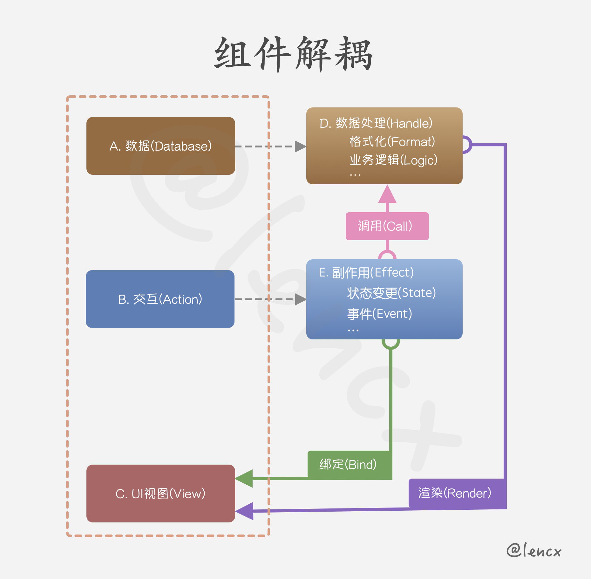

# 组件解耦

> 自前端三大框架([Vue](https://vuejs.org), [React](https://reactjs.org), [Angular](https://angular.io))以及后起之秀[Svelte](https://svelte.dev)出现之后，各种组件，轮子。大家都没少造过，一些大公司或者有精力的人，也在研究着`low code`或`no code`，有了一些落地或者具体方案。

## 背景

但就我自身经历及接触项目而言，项目还是停留在如何编写组件的层次上，简单的实现一些复用。一些历史项目因为需求的迭代，功能在不断增加，写代码的人员也在不断更替，交接。就会导致最后的接手项目的人痛苦不堪，~~重构？不现实，时间不够，之前的需求也不清楚。继续保持？就面临着怎么去在原项目之上继续迭代。~~ 进退两难。。。

在之前的需求毫不知情的情况下，如何完成需求功能的迭代，UI改版？只能通过全局搜索一些关键词，关键字去一步步向上debug源码。如果代码中牵扯过多的业务逻辑，就完全懵逼了，谁知道之前的需求是什么呀 ?_?!!!

以React为例，因为每个人都有自己对组件的理解，不同的人站在不同的维度去封装，就导致最后的项目结构，代码结构也是千差万别。

* `无状态组件`: 不涉及过多状态交互，很容易实现，大家的思路都差不多。
* `有状态组件`: 一旦涉及到状态，业务逻辑，交互。一个组件就变得不再可控。每个人的风格也都体现的淋漓尽致！
  * 组件内发起请求，各种请求，大量接口相互依赖。如果涉及到多个接口串行，后一个接口依赖上一个接口的返回值，写法又是各有特色。
  * 出现大量的业务逻辑分支，根据业务`return`出不同的组件╥﹏╥...
  * 直接在组件内实现一个或多个子组件(ノへ￣、)
  * 子组件上挂载着大量的`props`，属性有时候多到令人发指，有数据，方法，状态，自定义的xxx，...。各种传递。o(╥﹏╥)o
  * 欢迎大家继续补充...

## 思考

我对数据驱动UI视图的理解

* 数据，业务逻辑，交互都会影响最终需要渲染的UI视图。
* 编写组件时，首先分析业务需求，对组件进行分层。大致分为`数据(Database)`，`交互(Action)`，`UI视图(View)`三层。
  * **数据处理(Handle)**: 承载着核心业务逻辑，对数据进行格式化输出，供UI组件进行标准化接收。
  <!-- * **副作用(Effect)**:  -->

----

待更新，未完结...

## 参考链接

### Low Code

* [awesome-lowcode](https://github.com/taowen/awesome-lowcode): 国内低代码平台从业者交流
* [JSX Lite](https://github.com/BuilderIO/jsx-lite): Write components once, run everywhere. Compiles to Vue, React, Solid, and Liquid. Import code from Figma and Builder.io
